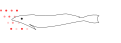
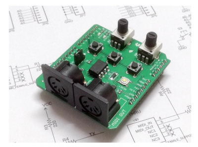

# Remora-matrix

Remora listens to UDP short commands or MIDI to trigger LED Matrix Animations. Receives ; commands from [ORCΛ](https://github.com/hundredrabbits/Orca)

## Launching matrix effects using MIDI as a trigger

Our previous [Firmware Remora](https://github.com/martinberlin/Remora) was intended to receive short commands from ORCΛ and make very simple Neopixels  animations on addressable LEDs stripes (WS2812B like)

To use this for the moment we convert incoming MIDI input to UDP using a **nodejs middleware**. To start it just go to the directory:

    cd middleware/midi-to-udp
    nodejs midi.js

There you will see what ports you have as incoming MIDI. You need a midi input source either an instrument or something you send from the computer itself. In my case I use a combination of Timidity and Rosegarden (Kind of Cakewalk for Linux). Once you see the port listed, just add there the -p (port) and -u (udp) IP address. UDP port is fixed to 49161 both in the middleware and also on the ESP32 Firmware. As an example:

    $ nodejs midi.js -p 3 -u 192.168.12.109
    Listening to: rosegarden:out 1 - General MIDI Device 130:3 and forwarding to 192.168.12.109:49161

This will redirect the MIDI notes to UDP. And the ESP32 will receive this UDP short messages and draw things in your LED Matrix.
On next updates we will also a second way, that is receiving directly the MIDI signal in the ESP32, that will require an Sparkfun Midi-Arduino module. The design to connect the ESP32 is still on the works and it will take some weeks more to see the light.
But if that works as expected, then there is no more middleware needed, and no more WiFi latence delay. So this should be actually the real thing if you want to be independant of WiFi. 



## Ideas to develop

* Use midi as a direct source to launch animations. No middlewares means less latency.
* Have an alternative [Nodejs midi middleware](https://github.com/martinberlin/Remora-midi/tree/master/middleware) as an alternative so you don't need midi special gear to use this Firmware.
* Use [Adafruit Neomatrix GFX](https://learn.adafruit.com/adafruit-neopixel-uberguide/neomatrix-library) as a graphic library for Neopixel matrix so you can treat it is as a display. That means full geometric functions and also font support.
* Build a new midi language that has full chord support, state (on/off) and velocity.

The language should be kept simple and also short so it can fly fast via UDP. First iteration looks like this:

```
Chord HEXA | note on/off (1 char) | velocity HEXA
48140 C on 40
48030 C off
```

* Build some simple animation effects based on the Chord / Velocity and keep the effect running till the note is released
* Also build a mode that is not animated but instead launches GFX's (Squares, Circles, you name it) with different locations using Chord and sizes based on velocity.
So a C pressed lightly will make a small circle, a D pressed strong will make a bigger one some pixels ahead.

## Demos organization in this repository

Please make sure to edit platformio.ini and uncomment only one of the **src_dir** folders to select what example to run.
For example if you want to run the UDP to MIDI firmware just uncomment this line:

```
#Uncomment only one of the folders to select what example to run:
#src_dir = firmware/adafruit-matrix-test
src_dir = firmware/udp-midi-matrix
```
Then compiling will just pick this directory and flash it to your ESP32.

Requirements are in **platformio.ini** file. Check it out and adapt it to your board and needs.
This works super fast thanks of the work of amazing Marc Merlin's fork for [FastLED_NeoMatrix](https://github.com/marcmerlin/FastLED_NeoMatrix) that is what sends the data to your addressable LEDs data PIN.


## Companion applications

* [Remora](https://github.com/martinberlin/Remora) just for short Led stripe animations
* [ORCΛ Sequencer](https://github.com/hundredrabbits/Orca)